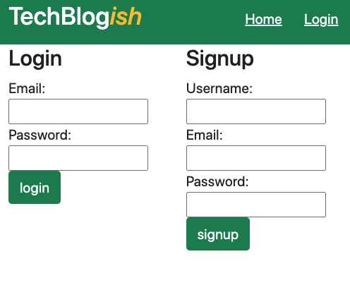

# Tech Blogish

## Table of Contents
- [Description](#description)
- [Installation](#installation)
- [Usage](#usage)
- [Technology](#technology)

# Description
This Tech blog chronicles personal commentary on varius issues relating to Technology and Web Development.

# Installation
To install, clone the Github repository and add it to your local repo via your choice code-editing software (ie Visual Studio Code).

# Usage
Upon login, the user is introduced to the collection of TechBlogish posts, listed in chronological order. The user has the option add, edit, or delete comments on each post.

* Login / Sign Up Page

* Blog Posts:

# Technology
This application was made possible with the use of the follow dev tools:
* Node.js
* Express.js
* MySQL
* Sequelize
* Dotenv
* JawsDb
